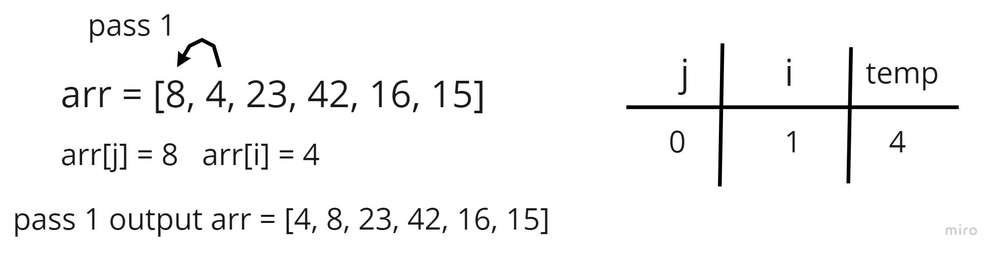
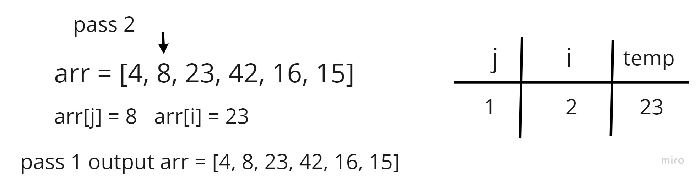
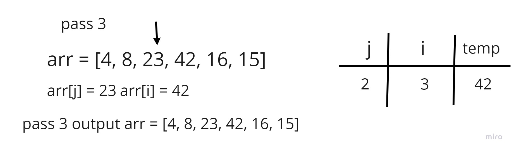
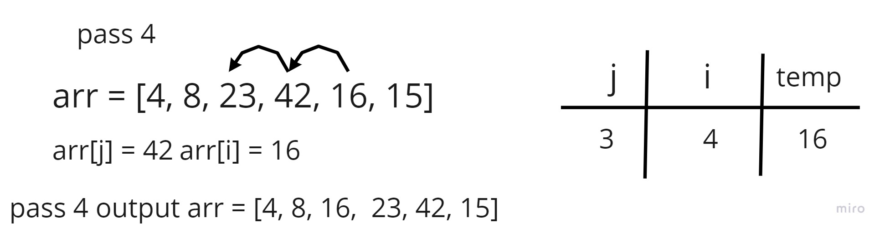
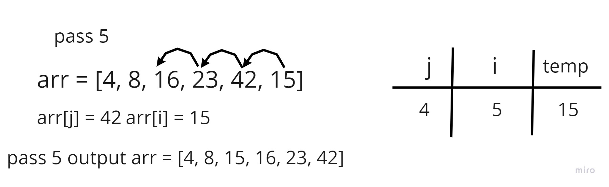
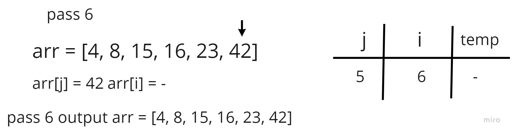

## Insertion Sort

Insertion Sort is a sorting algorithm that traverses the array multiple times as it slowly builds out the sorting sequence. The traversal keeps compair each index with all index and shift between any index that is greater than the next one and reapeat it constantly till it all been sorted

## Pseudocode

    SelectionSort(int[] arr)
       DECLARE n <-- arr.Length;
       FOR i = 0; i to n - 1  
           DECLARE min <-- i;
           FOR j = i + 1 to n
               if (arr[j] < arr[min])
                  min <-- j;
           DECLARE temp <-- arr[min];
          arr[min] <-- arr[i];
          arr[i] <-- temp;

## code 

    function InsertionSort(arr) {
       for (let i = 1; i < arr.length; i++) {
            let j = i - 1
            let temp = arr[i]
            while (j >= 0 && temp < arr[j]) {
                arr[j+1] = arr[j]
                j = j-1
                arr[j+1] = temp
            }
        }
        return arr
    }

## pass 1

In the first pass through of the selection sort, we evaluate if there is a smaller number in the array than what is currently present in index 0.

## pass 2

In the second pass through of the selection sort, we evaluate if there is a smaller number in the array than what is currently present in index 1.

## pass 3

In the third pass through of the selection sort, we evaluate if there is a smaller number in the array than what is currently present in index 2.

## pass 4

In the third pass through of the selection sort, we evaluate if there is a smaller number in the array than what is currently present in index 3.

## pass 5

In the third pass through of the selection sort, we evaluate if there is a smaller number in the array than what is currently present in index 4.

## pass 6

In the third pass through of the selection sort, we evaluate if there is a smaller number in the array than what is currently present in index 5.

## Efficency
* **Time: O(n^2) :**

The basic operation of this algorithm is comparison. This will happen n * (n-1) number of times…concluding the algorithm to be n squared.

* **Space: O(1) :**

No additional space is being created. This array is being sorted in place…keeping the space at constant O(1).