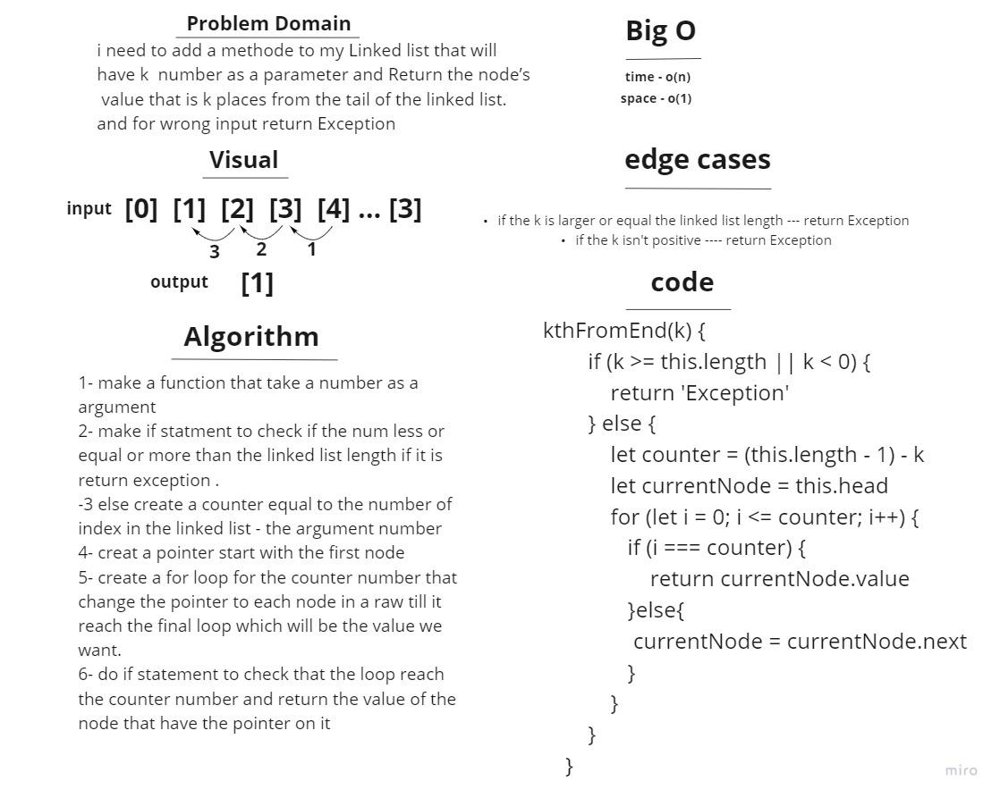

# linked-list-kth
i need to add a methode to my Linked list that will
have k  number as a parameter and Return the node’s
 value that is k places from the tail of the linked list.
and for wrong input return Exception
# whiteboared 

