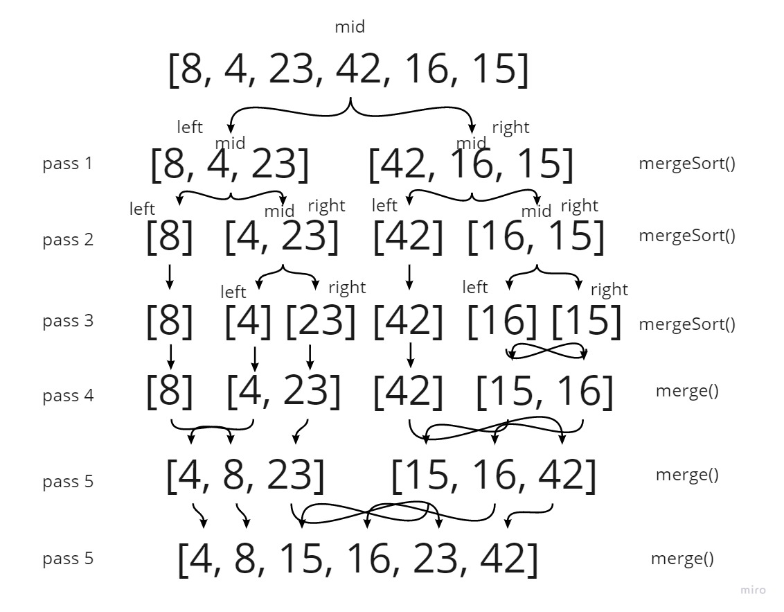

o(n*logn)
o(n)
## Merge Sort

the merging sort is basicly divide the array into tow array and each aray dividd to to array again til it length become one then start to compain each tow number togother again and sort them and then do it again with the compain array til you reach all the data in all arrays

## visual tracking for code 

## Pseudocode

    ALGORITHM Mergesort(arr)
    DECLARE n <-- arr.length

    if n > 1
      DECLARE mid <-- n/2
      DECLARE left <-- arr[0...mid]
      DECLARE right <-- arr[mid...n]
      // sort the left side
      Mergesort(left)
      // sort the right side
      Mergesort(right)
      // merge the sorted left and right sides together
      Merge(left, right, arr)

     ALGORITHM Merge(left, right, arr)
    DECLARE i <-- 0
    DECLARE j <-- 0
    DECLARE k <-- 0

    while i < left.length && j < right.length
        if left[i] <= right[j]
            arr[k] <-- left[i]
            i <-- i + 1
        else
            arr[k] <-- right[j]
            j <-- j + 1

        k <-- k + 1

    if i = left.length
       set remaining entries in arr to remaining values in right
    else
       set remaining entries in arr to remaining values in left

## code

    function mergeSort(arr) {
    const n = arr.length
    if (n > 1) {
        let mid = n / 2
        let left = arr.slice(0, mid)
        let right = arr.splice(mid)
        mergeSort(left)
        mergeSort(right)
        merge(left, right, arr)
    }    
    }
    function merge(left, right, arr) {
    let i = 0
    let j = 0
    let k = 0
    while (i < left.length && j < right.length) {
        if (left[i] <= right[j]) {
            arr[k] = left[i]
            i += 1
        } else {
            arr[k] = right[j]
            j += 1
        }
        k += 1
    }
    if (i === left.length) {
        for (let l = j; l < right.length; l++) {
            arr.push(right[l])
        }
    } else {
        for (let l = i; l < left.length; l++) {
            arr.push(left[l])
        }
    }    
}

## Efficency
* **Time: O(n*log n) :**
* **space: O(n) :**