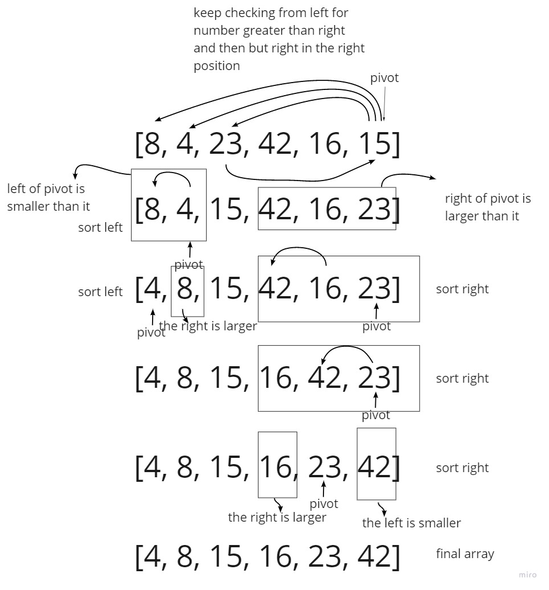

## Quick Sort

the sorting algorithm uses theidea of divide and conquer, it finds the element called Pivot which divides the array into tow array in such a way that elements ib the left half are smaler than pivot and elements in the right are greater than pivot.

## tracking the code 

1- make the pivot as the last element

2- keep compairing the element from left to right with pivot to finde the apropiate position for the pivot to have the smaller number in the left and the larger number in the right .

3- quick sort the left in same way

4- quick sort the right in the same way.

  
  ## Pseudocode

     ALGORITHM QuickSort(arr, left, right)
       if left < right
           // Partition the array by setting the position of the pivot value
           DEFINE position <-- Partition(arr, left, right)
           // Sort the left
           QuickSort(arr, left, position - 1)
           // Sort the right
           QuickSort(arr, position + 1, right)

    ALGORITHM Partition(arr, left, right)
        // set a pivot value as a point of reference
        DEFINE pivot <-- arr[right]
        // create a variable to track the largest index of numbers lower than the defined pivot
       DEFINE low <-- left - 1
        for i <- left to right do
            if arr[i] <= pivot
                low++
                Swap(arr, i, low)

     // place the value of the pivot location in the middle.
     // all numbers smaller than the pivot are on the left, larger on the right.
     Swap(arr, right, low + 1)
    // return the pivot index point
     return low + 1

    ALGORITHM Swap(arr, i, low)
        DEFINE temp;
        temp <-- arr[i]
        arr[i] <-- arr[low]
        arr[low] <-- temp

## code

        function quickSort(arr, left, right) {
         if (left < right) {
           let position = partition(arr, left, right)
           quickSort(arr, left, position - 1)
           quickSort(arr, position + 1, right)
         }
        return arr
     }
    function partition(arr, left, right) {
      let pivot = arr[right]
      let low = left - 1
      for (let i = left; i < right; i++) {
        if (arr[i] <= pivot) {
            low += 1
            swap(arr, i, low)
        }
      }
      swap(arr, right, low + 1)
      return low + 1
    }
    function swap(arr, i, low) {
       let temp
       temp = arr[i]
       arr[i] = arr[low]
       arr[low] = temp   
     }

## Efficency
* **Time: O(n^2) :**
* **space: O(log n) :**