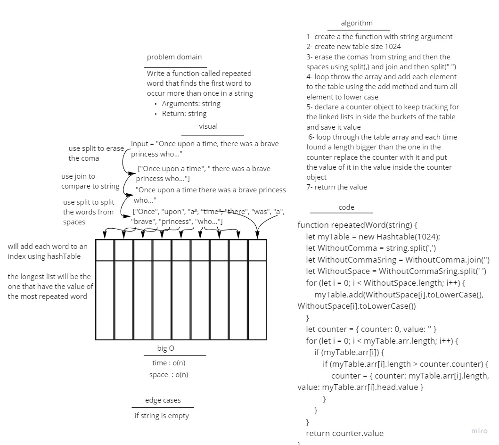

# Hashtables

## chalenge 

 hashmap-repeated-word

## problim Domain

Write a function called repeated word that finds the first word to occur more than once in a string

Arguments: string

Return: string

## whiteboard 

